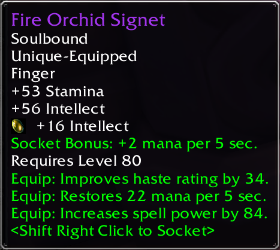
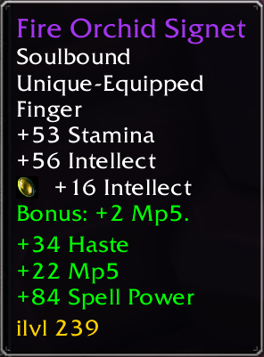

## SimplifyTooltip: Retail like tooltips in Classic WoW

SimplifyTooltip aims to greatly reduce the visual noise present on tooltips in classic WoW.

Rather than displaying "Equip: Improves critical strike rating by 10.", the tooltip will instead display "+10 Crit". This is similar to the way retail WoW tooltips look.

### Before

### After

Note: this addon currently only works with English language versions of the game.
